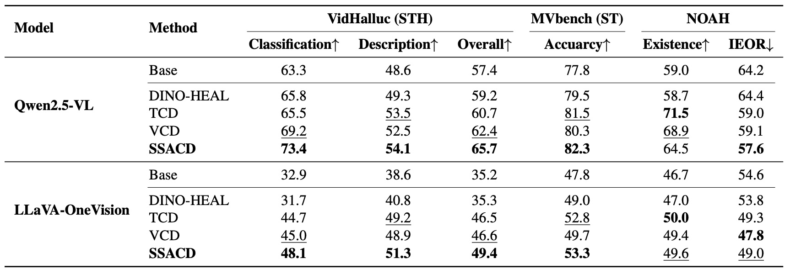
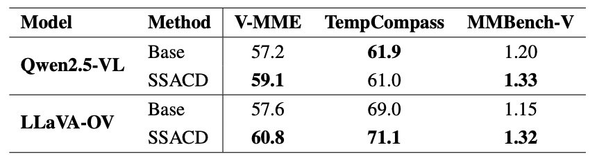

# SSACD: Semantic Shift-Aware Contrastive Decoding for Mitigating Hallucinations and Omissions in Video Large Language Models
This is the official repo for Semantic Shift-Aware Contrastive Deocding for Mitigating Hallucinations and Omissions in Video Large Language Models. 

<div style='display:flex; gap: 0.25rem; '>
<a href='https://arxiv.org/abs/2311.16922'></a>
</div>

## 🎯 Overview

- **SSACD** is a training-free decoding method designed to reduce scene-transition hallucination in Video LLMs. It introduces a contrastive signal that leverages semantic-shift awareness to suppress narrative-prior–driven errors.
### Key Idea
- Video LLMs often rely too heavily on their narrative prior—the tendency to maintain temporal and semantic coherence—especially when a major semantic change occurs in the video. This can lead to:
hallucinating a scene transition,
imagining missing intermediate scenes,
or incorrectly treating different scenes as continuous.

- SSACD addresses this by intentionally perturbing the video where the largest semantic shift occurs. All frames after this point are injected with Gaussian noise, creating a perturbed video that exaggerates the model’s narrative-prior bias.
### Method Overview
- Detect the frame with the maximum semantic shift.
Apply noise to all subsequent frames to construct a perturbed video.
Compute logits from both the original and perturbed videos.
Combine them through contrastive decoding so that tokens preferred only under the perturbed (bias-enhancing) video are down-weighted.
Optionally apply a plausibility constraint to ensure stable decoding.

## 🕹️ Usage
### Environment Setup
```bash
conda create -yn SSACD python=3.12
conda activate SSACD
cd SSACD
pip install -r requirements.txt
```

### How to Use VCD in LVLMs
For a comprehensive example of applying SSACD to Video LLMs, please refer to the Jupyter notebook:
```bash
src/example_qwen_vl.ipynb
```
This notebook demonstrates:
- Loading video frames and detecting semantic shifts using CLIP
- Constructing perturbed video representations aligned with scene transitions
- Applying SSACD during decoding with customizable hyperparameters (α, β, σ, τ)
- Comparing outputs between baseline and SSACD-enhanced inference


## 🧪 Experiments

We evaluate SSACD on scene transition understanding benchmarks while ensuring it preserves general video understanding performance.

### Benchmarks

**Scene Transition Understanding:**
- **VidHalluc (STH)** - Classification, Description, and Overall metrics
- **MVBench** - Scene transition classification task
- **NOAH** - Inserted event detection (IEOR, Existence)

**General Video Understanding:**
- **Video-MME**, **TempCompass**, **MMBench-Video**

### Models & Baselines
- **Models**: Qwen2.5-VL (7B), LLaVA-OneVision (7B)
- **Baselines**: Base, DINO-HEAL, VCD, TCD

### Main Results



For detailed results, ablation studies, and analysis, please refer to our paper and supplementary materials.


## 📌 Examples


## 📑 Citation
If you find our project useful, we hope you can star our repo and cite our paper as follows:
```
@article{anonymous2026ssacd,
  author    = {Anonymous},
  title     = {SSACD: Semantic Shift-Aware Contrastive Decoding for Mitigating Hallucinations and Omissions in Video Large Language Models},
  journal   = {Under Review},
  year      = {2026},
}
```